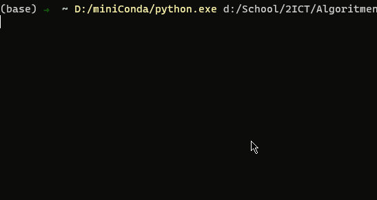

# Snakepong by Thomas
## Concept
This game is a combination of the classic Pong and Snake games. The player is able to control the snake using the z, q, s and d keys. The goal is to get the ball past the pallet on the left side. If this happens, the snake will grow and the ball will reset. The game ends if the snake collides with the walls or  its own body.
<br>
Have fun!

## Demo


## Requirements
This application utilizes the [numpy](https://numpy.org/) library. Use pip to install: <br>
```
pip install numpy
```
or with conda:
```
conda install numpy
```

## Program Structure
The main components of this game are:
* __Game__: This is the main class of this application. It contains the game-loop and is able to utilize almost all other classes. 
* __Arena__: This class contains the field that holds all objects such as snake, ball and paddle. The arena itself is a multidimensional array made with numpy. Initially, every spot in this array contains a `0`. As objects are loaded onto the arena spots on the arena containing an object get a different value. For example, the place where the ball is located gets a `2` as value, a place containing a part of the snake gets a `3`. The class also contains a method to print the arena in the console and to clear the arena.  
* __Movement__: This class is responsible for the movement of the snake, ball and paddle. It also checks whether different objects collide with each other.
* __Snake__: This class is in essence a single linked list. Each node in this list contains a coordinate which resembles a piece of the snakes body. The class also contains methods which make the snake able to grow, move and be able to print on the arena.
* __Paddle__: This class contains all values that make up the functionality of a paddle. Some of the values are: direction, position and length.
* __Ball__: This contains the position and direction of the ball as well methods to place the ball on the arena and detect a possible goal.
* __Wall__: The sole purpose of this class is to load a `1` on the borders of the arena to create a wall.

### Diagram
This diagram shows a simplified overview of every class along with its most important methods.
